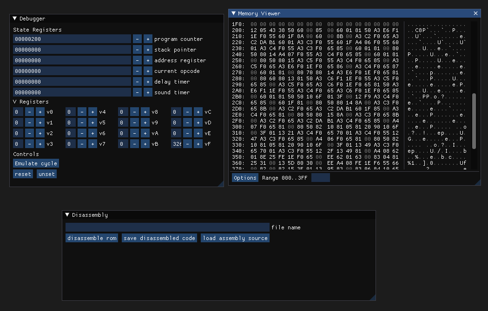

# Migraine

Migraine is an attempt to create a full environment for chip8 made of an emulator, a debugger, an assembler, a disassembler and a compiler

It's called Migraine because trust me, this project is a real headache



## Status

So I'm tempted to call this project a train wreck at this point :(

- The emulator is not functional
- The renderer for the emulator screen has been totally commented out because it just needs to be rewritten fully
- The debugger is still very behind
- The assembler is half ok
- The disassembler is still in very early stages
- The compiler is still just a dream for now

The road is still very long but I'll make it work (or so I want to believe)

## Dependencies

- SDL2
- OpenGL

## Build

You need CMake to build this program

```
mkdir build
cd build
cmake ..
make
```
